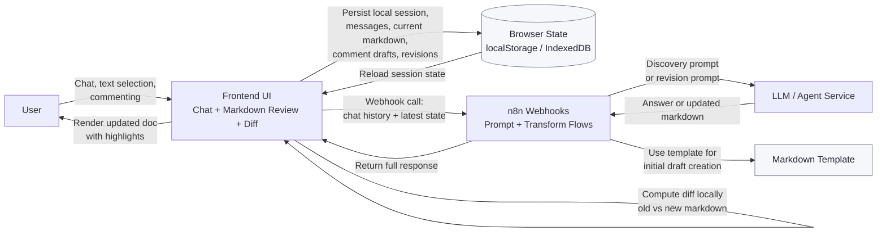

# Architecture Overview

This diagram shows the minimized MVP: no custom backend, browser-owned state, and n8n-style webhooks for orchestration.

```mermaid
flowchart LR
    U[User]
    FE[Frontend UI\nChat + Markdown Review + Diff]
    BROWSER[(Browser State\nlocalStorage / IndexedDB)]
    WEBHOOK[n8n Webhooks\nPrompt + Transform Flows]
    AGENT[LLM / Agent Service]
    TEMPLATE[Markdown Template]

    U -->|Chat, text selection,\ncommenting| FE
    FE -->|Persist local session,\nmessages, current markdown,\ncomment drafts, revisions| BROWSER
    BROWSER -->|Reload session state| FE

    FE -->|Webhook call:\nchat history + latest state| WEBHOOK
    WEBHOOK -->|Discovery prompt\nor revision prompt| AGENT
    AGENT -->|Answer or updated markdown| WEBHOOK
    WEBHOOK -->|Return full response| FE

    WEBHOOK -->|Use template for\ninitial draft creation| TEMPLATE

    FE -->|Compute diff locally\nold vs new markdown| FE
    FE -->|Render updated doc\nwith highlights| U

    classDef store fill:#f6f7fb,stroke:#7b8190,color:#1f2430;
    class BROWSER,TEMPLATE store;
```
