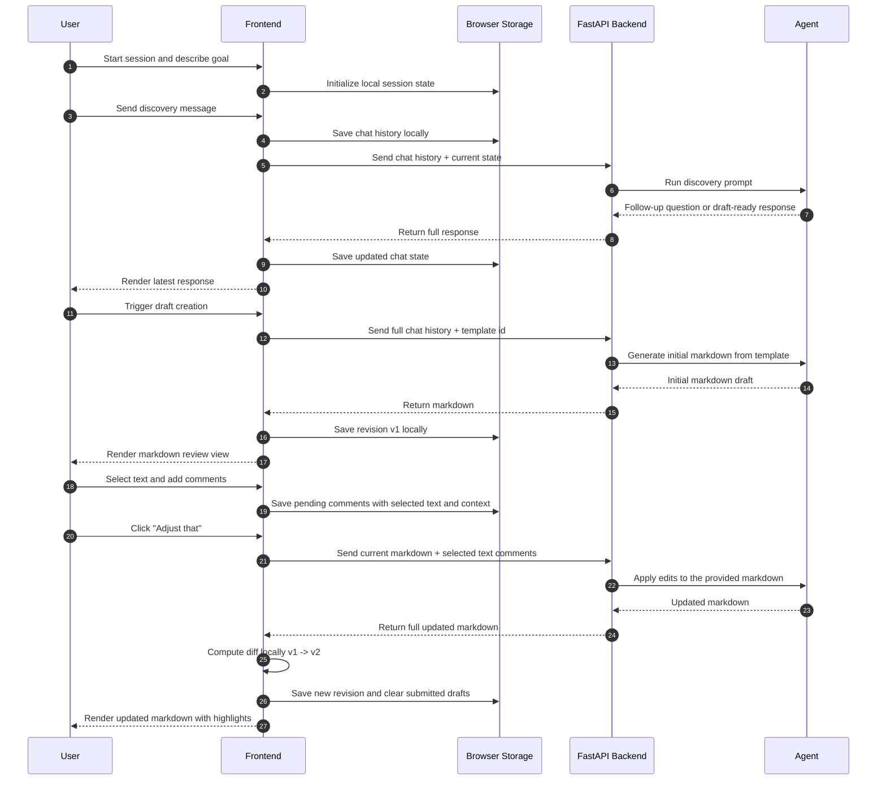

# Revision Comment Flow

This sequence diagram shows the current runtime flow with frontend-owned state and webhook-style FastAPI agent calls.

```mermaid
sequenceDiagram
    autonumber
    participant U as User
    participant FE as Frontend
    participant LS as Browser Storage
    participant WH as FastAPI Backend
    participant A as Agent

    U->>FE: Start session and describe goal
    FE->>LS: Initialize local session state

    U->>FE: Send discovery message
    FE->>LS: Save chat history locally
    FE->>WH: Send chat history + current state
    WH->>A: Run discovery prompt
    A-->>WH: Follow-up question or draft-ready response
    WH-->>FE: Return full response
    FE->>LS: Save updated chat state
    FE-->>U: Render latest response

    U->>FE: Trigger draft creation
    FE->>WH: Send full chat history + template id
    WH->>A: Generate initial markdown from template
    A-->>WH: Initial markdown draft
    WH-->>FE: Return markdown
    FE->>LS: Save revision v1 locally
    FE-->>U: Render markdown review view

    U->>FE: Select text and add comments
    FE->>LS: Save pending comments with selected text and context
    U->>FE: Click "Adjust that"
    FE->>WH: Send current markdown + selected text comments
    WH->>A: Apply edits to the provided markdown
    A-->>WH: Updated markdown
    WH-->>FE: Return full updated markdown
    FE->>FE: Compute diff locally v1 -> v2
    FE->>LS: Save new revision and clear submitted drafts
    FE-->>U: Render updated markdown with highlights
```
